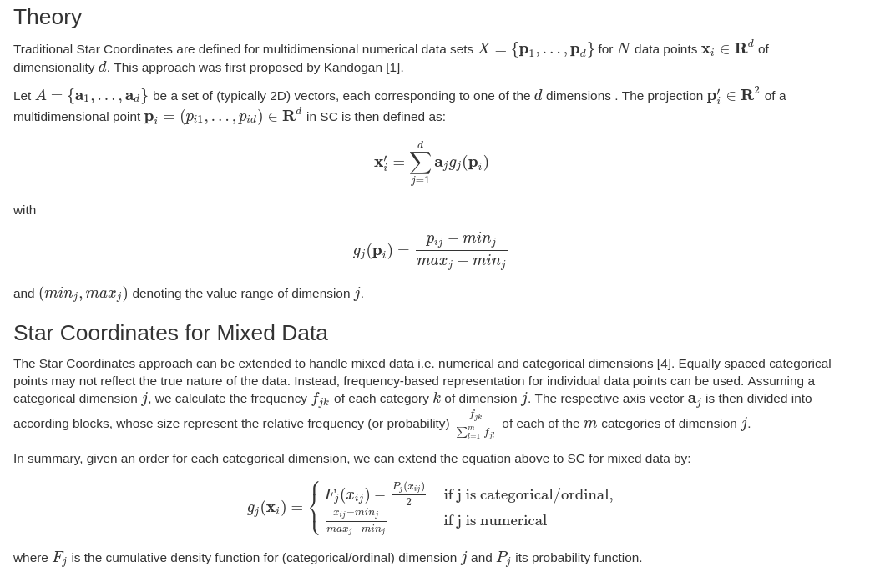

## Star Coordinates

The following package creates a RShiny Gadget for Star Coordinates which allows for initial data exploration. 

* **param** *df:*  A dataframe with the data to explore. It should contain only numeric or factor columns.
* **param** *colorVar:* column where labels from the data are extracted.
* **param** *approach:* Standard approach as defined by Kandogan, or Orthographic Star Coordinates (OSC) with a recondition as defined by Lehmann and Thiesel
* **param** *numericRepresentation:* if true attempt to convert all factors to numeric representation, otherwise used mixed representation as defined in Hinted Star Coordinates
* **param** *meanCentered:* center the projection at the mean of the values. May allow for easier value estimation
* **param** *projMatrix:* a pre-defined projection matrix as an initial configuration. Should be defined in the same fashion as the output
* **param** *clusterFunc:* function to define hints, assume increase in value of the function is an increase in quality of the projection. The function will be called with two parameters (points, labels)

* **returns** A list with the projection matrix, coordinates of the projected samples and a logical vector with the selected samples

### References

1. Kandogan, E. (2001, August). Visualizing multi-dimensional clusters, trends, and outliers using star coordinates. In Proceedings of the seventh ACM SIGKDD international conference on Knowledge discovery and data mining (pp. 107-116).

2. Lehmann, D. J., & Theisel, H. (2013). Orthographic star coordinates. IEEE Transactions on Visualization and Computer Graphics, 19(12), 2615-2624.

3. Rubio-Sánchez, M., & Sanchez, A. (2014). Axis calibration for improving data attribute estimation in star coordinates plots. IEEE transactions on visualization and computer graphics, 20(12), 2013-2022

4. Matute, J., & Linsen, L. (2020). Hinted Star Coordinates for Mixed Data. In Computer Graphics Forum (Vol. 39, No. 1, pp. 117-133).

### Examples

#### Traditional Star Coordinates 

    library(datasets)
    data(iris)
    StarCoordinates(iris)
    

#### Star Coordinates with Class Exploration

    StarCoordinates(iris, colorVar ="Species ")

#### Mean Centering

Mean centering is enabled by default. 

    StarCoordinates(iris, colorVar ="Species" , meanCentered = FALSE)
    

#### Non-numeric Representation

By setting numeric representation to false, Star Coordinates uses the mixed data approach defined in [4] for the mapping.

    StarCoordinates(iris, numericRepresentation = FALSE )

   
  
