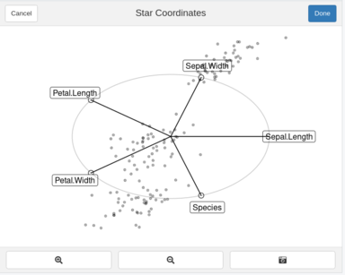

```{r setup, include=FALSE}
knitr::opts_chunk$set(echo = TRUE)
library(knitr)
```

## Radial Vis Gadgets

The RadialVisGadgets package provides interactive Shiny gadgets for interactive radial visualizations. By interacting with the gadgets, Exploratory Data Analysis can be performed. The gadgets can be used at any time during the analysis. They allow the exploration of the underlying nature of the data in tasks related to cluster analysis, outlier detection, and exploratory data analysis, e.g., by investigating the effect of specific dimensions on the separation of the data.

[Star Coordinates](#Star)

### Star Coordinates {#Star}

Star Coordinate's (SC) goal is to generate a configuration of the dimensional vectors which reveals the underlying nature of the data. Let's look at the well known *Iris* dataset [1]. 

```{r, eval=FALSE}
library(RadialVisGadgets)
library(datasets)
data(iris) 

result <- StarCoordinates(iris)
```
```{r, echo=FALSE}
kable(head(iris))
```

One can observe four numerical attributes and one factor. The traditional Star Coordinates approach is defined for numerical attributes only. Therefore, as default we set attempt the conversion of all factors to numerical attributes. This can be disabled with numericRepresentation = FALSE to be described below.  

Following the traditional approach [2] the five attributes are placed at equal angle steps from each other. 




You can move your move towards the endings of the dimensional vectors. The circle at the end will be highlighted.
As you can see in the figure below.


You can move these axes in order to create a configuration that you believe suitable and brush a selection of points.


#### Buttons

**Done:** Once a selection is done. One can press the *Done* button, the Star Coordinates Gadget will return a list given the projection matrix, a logical vector of the selection and the projection points (in 2D).

**Screenshot:** Takes a screenshot of the configuration at its current state

**Zoom in/out:** Self-explanatory. Zooms in and out of the plot

**Hints:** Used when colorVar and clusterFunc are provided. Creates the hints for the current configuration. 

```{r}
# names(result)
# [1] "Proj.Matrix"      "Selection"        "Projected.Points"
```

#### Orthographic Star Coordinates Approach

Orthographic Star Coordinates are supported by the Star Coordinates by adding the approach="OSC" parameter. The axes are reconditioned with every movement as described by Lehmann & Theisel [3]. The interaction is kept the same as before. With this approach, the dimensional vectors are constrained under conditions described in [3].

```{r, eval=FALSE}
StarCoordinates(iris, approach="OSC")
```


#### Numeric Representation = FALSE

The traditional approach [2] was defined for numerical attributes only. However [4] extended the approach to mixed datasets.
The axis for the factor dimensions are divided according to the frequency of each categorical value within the categorical dimension.
Given that the 3 species labels are uniformly distributed, 2 ticks appear separating the 3 blocks for each categorical dimension.


By clicking at the axis, you can activate it. The categorical value blocks are now visible on the selected factor.


By double-clicking on a categorical block, the value the block represents is highlighted. If another categorical block is selected by double-clicking, then those two blocks will swap with each other. Allowing to shift categorical values in one dimension. You can disable a categorical selection by double clicking a second time in the same categorical block.


#### Labels in analysis

```{r, eval=FALSE}
StarCoordinates(iris, colorVar="Species")
```

By sending a factor dimension name in colorVar, the analysis can be performed on labeled data.  
The points are then coloured according to the selected dimension. The "Standard" and "OSC" approach are avaible for both analysis.


#### Hints 

Hints are used to describe possible movements if a label and a function is provided. A button named *Hint* will appear. An increase in the evaluation of the function defines an increase in projection quality i.e. larger values are better. Details on the hints usage are defined in [4]. The thickness of the segments represent an increase in *quality*. In the figure below, it would imply that interacting with Petal.Width by moving it down will result an increase in *quality*.  The absolute maximum increase in quality is shown in the Hint Button, allowing for early termination. The hints are computed on-demand only and are based on the current vector configuration. Once a movement is performed, the hints will disappear.

```{r, eval=FALSE}
library(clValid)
func <- function(points, labels){ dunn(Data=points, clusters=labels)}
StarCoordinates(iris, colorVar="Species", clusterFunc = func) 
```


### Notes On Data Processing 

* **Missing Data:** Only complete-cases are used i.e. rows where data is missing are removed
* **Zero Variance:** Zero or close to zero variance dimensions are removed.
* **Scaling:** If the values are not mean centered then each dimension is scaled from 0..1.
* **Mean Centered:** A normalization step as described in [5] is performed if meanCentered =TRUE (default).

1. Fisher, R. A. (1936). The use of multiple measurements in taxonomic problems. Annals of eugenics, 7(2), 179-188.
2. Kandogan, E. (2001, August). Visualizing multi-dimensional clusters, trends, and outliers using star coordinates. In Proceedings of the seventh ACM SIGKDD international conference on Knowledge discovery and data mining (pp. 107-116).
3. Lehmann, D. J., & Theisel, H. (2013). Orthographic star coordinates. IEEE Transactions on Visualization and Computer Graphics, 19(12), 2615-2624.
4. Matute, J., & Linsen, L. (2020). Hinted Star Coordinates for Mixed Data. In Computer Graphics Forum (Vol. 39, No. 1, pp. 117-133).
5. Rubio-Sánchez, M., & Sanchez, A. (2014). Axis calibration for improving data attribute estimation in star coordinates plots. IEEE transactions on visualization and computer graphics, 20(12), 2013-2022


